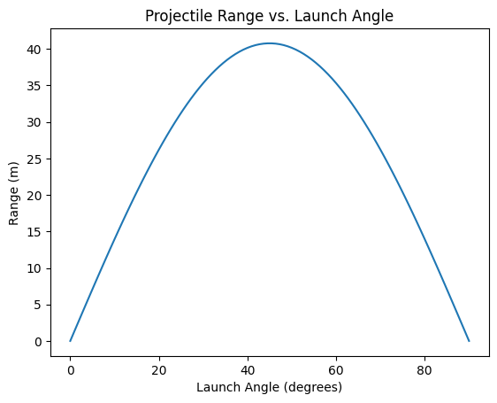

# Problem 1
# Investigating the Range as a Function of the Angle of Projection

## 1. Theoretical Foundation

### Governing Equations of Motion
Projectile motion follows two-dimensional kinematics under the influence of gravity. The key equations of motion are:

- **Horizontal Motion** (constant velocity):
  $$
  x(t) = v_0 \cos(\theta) t
  $$
- **Vertical Motion** (accelerated motion due to gravity):
  $$
  y(t) = v_0 \sin(\theta) t - \frac{1}{2} g t^2
  $$

where:
- $ v_0 $ = initial velocity
- $ \theta $ = angle of projection
- $ g $ = acceleration due to gravity (typically $ 9.81 \, m/s^2 $)
- $ x(t) $ and $ y(t) $ represent position at time $ t $

### Time of Flight
The projectile reaches the ground when $ y = 0 $:
$$
 t_f = \frac{2 v_0 \sin(\theta)}{g}
$$

### Range of the Projectile
The horizontal range is given by:
$$
R = \frac{v_0^2 \sin(2\theta)}{g}
$$

### Maximum Height
The peak height is:
$$
H = \frac{v_0^2 \sin^2(\theta)}{2g}
$$

## 2. Analysis of the Range
- The range $ R $ depends on $ \theta $ through the $ \sin(2\theta) $ function.
- The maximum range occurs at $ \theta = 45^\circ $, since $ \sin(90^\circ) = 1 $.
- Increasing $ v_0 $ increases $ R $ quadratically.

## 3. Example Calculations
### Example 1: Compute the Range for Different Angles
Let $ v_0 = 20 $ m/s and $ g = 9.81 $ m/s².
- For $ \theta = 30^\circ $:
  $$
  R = \frac{20^2 \sin(60^\circ)}{9.81} \approx 35.3 \text{ m}
  $$
- For $ \theta = 45^\circ $:
  $$
  R = \frac{20^2 \sin(90^\circ)}{9.81} \approx 40.8 \text{ m}
  $$

## 4. Python Simulation
```python
import numpy as np
import matplotlib.pyplot as plt

def projectile_range(v0, theta, g=9.81):
    theta_rad = np.radians(theta)
    return (v0**2 * np.sin(2 * theta_rad)) / g

thetas = np.linspace(0, 90, 100)
ranges = [projectile_range(20, theta) for theta in thetas]

plt.plot(thetas, ranges)
plt.xlabel('Launch Angle (degrees)')
plt.ylabel('Range (m)')
plt.title('Projectile Range vs. Launch Angle')
plt.show()
```


## 5. Discussion
- The parabolic shape of the curve confirms that the optimal angle is $ 45^\circ $.
- Air resistance is ignored but would reduce the range in real scenarios.
- Uneven terrain would modify the equations, requiring numerical solutions.

This document provides a structured approach to understanding and simulating projectile motion.
...


