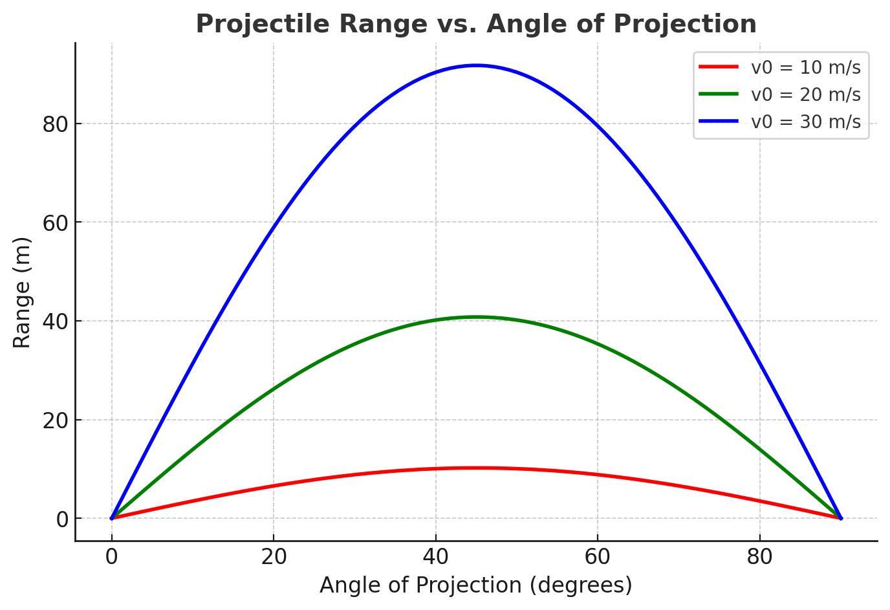
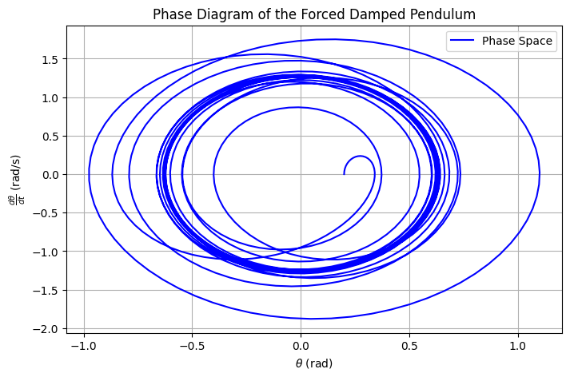

# Problem 1
## Investigating the Range as a Function of the Angle of Projection

### 1. Theoretical Foundation

Projectile motion follows Newton’s laws of motion. The fundamental equations describing the motion of a projectile launched with initial speed $v_0$ at an angle $\theta$ (neglecting air resistance) are derived from kinematic equations.

#### **Equations of Motion**

The horizontal and vertical components of velocity are:

$$
 v_{0x} = v_0 \cos\theta 
$$

$$
 v_{0y} = v_0 \sin\theta 
$$

The position as a function of time is given by:

$$
 x(t) = v_0 \cos\theta \cdot t 
$$

$$
 y(t) = v_0 \sin\theta \cdot t - \frac{1}{2} g t^2 
$$

where $g$ is the acceleration due to gravity.

#### **Time of Flight**

The projectile returns to the ground when $y = 0$:

$$
 0 = v_0 \sin\theta \cdot t - \frac{1}{2} g t^2 
$$

Solving for $t$:

$$
 t = \frac{2 v_0 \sin\theta}{g} 
$$

#### **Range of the Projectile**

The range $R$ is the horizontal distance when $y = 0$:

$$
 R = v_0 \cos\theta \cdot t 
$$

Substituting $t$:

$$
 R = \frac{v_0^2 \sin 2\theta}{g} 
$$

This equation shows that the range is maximized when $\theta = 45^\circ$.

---

### 2. Analysis of the Range

- The range is symmetric about $45^\circ$.
- Increasing $v_0$ increases the range quadratically.
- Higher gravitational acceleration $g$ reduces the range.

---

### 3. Python Simulation

Below is a Python script to visualize the range as a function of angle:



```python
import numpy as np
import matplotlib.pyplot as plt

g = 9.81  # Acceleration due to gravity (m/s^2)
v0 = 20  # Initial velocity (m/s)

theta = np.linspace(0, 90, 100)  # Angle from 0 to 90 degrees
R = (v0**2 * np.sin(2 * np.radians(theta))) / g

plt.figure(figsize=(8, 5))
plt.plot(theta, R, label=f'v0 = {v0} m/s')
plt.xlabel('Angle of Projection (degrees)')
plt.ylabel('Range (m)')
plt.title('Projectile Range vs. Angle of Projection')
plt.legend()
plt.grid()
plt.show()
```
---
# **Forced Damped Pendulum: Applications and Implementation**

## **3. Practical Applications**
The **forced damped pendulum** is widely used in real-world applications:

### **1. Energy Harvesting Devices**  
- Systems like **electromagnetic energy harvesters** utilize forced damped pendulums to convert mechanical vibrations into electrical energy.  
- **Example:** Piezoelectric energy harvesting in wearable devices.

### **2. Suspension Bridges & Structural Engineering**  
- Bridges experience oscillations due to wind, traffic, and seismic activity, modeled using a forced damped pendulum.  
- **Example:** The **Tacoma Narrows Bridge** collapse due to resonance effects.

### **3. Oscillating Circuits (RLC Circuits in Electronics)**  
- The equation governing an **RLC circuit** (with resistance, inductance, and capacitance) is mathematically equivalent to a forced damped pendulum.  
- **Example:** Radio-frequency circuits where damping affects signal stability.

---

## **4. Implementation: Computational Model**
We numerically simulate the motion of a **forced damped pendulum** and visualize its behavior.

### **Mathematical Model**  
The equation of motion is:

$$
\frac{d^2\theta}{dt^2} + \gamma \frac{d\theta}{dt} + \omega_0^2 \sin\theta = A \cos(\omega t)
$$

where:

$$ \gamma $$ - is the damping coefficient,  
$$ \omega_0 $$ - is the natural frequency,  
$$ A $$ - is the amplitude of the external driving force,  
$$ \omega $$ - is the driving frequency.
## To observe chaos, we plot the Poincaré section:



```python
import numpy as np
import matplotlib.pyplot as plt
from scipy.integrate import solve_ivp

# Constants
gamma = 0.2  # Damping coefficient
omega0 = 1.5  # Natural frequency
A = 1.2  # Driving force amplitude
omega = 2.0  # Driving frequency

# Equations of motion
def forced_damped_pendulum(t, y):
    theta, omega_theta = y
    dtheta_dt = omega_theta
    domega_dt = -gamma * omega_theta - omega0**2 * np.sin(theta) + A * np.cos(omega * t)
    return [dtheta_dt, domega_dt]

# Time range
t_span = (0, 50)
t_eval = np.linspace(*t_span, 1000)

# Initial conditions
y0 = [0.2, 0]

# Solve the differential equation
sol = solve_ivp(forced_damped_pendulum, t_span, y0, t_eval=t_eval)

# Phase Diagram
plt.figure(figsize=(8, 5))
plt.plot(sol.y[0], sol.y[1], color='b', label='Phase Space')
plt.xlabel(r'$\theta$ (rad)')
plt.ylabel(r'$\frac{d\theta}{dt}$ (rad/s)')
plt.title('Phase Diagram of the Forced Damped Pendulum')
plt.legend()
plt.grid(True)
plt.show()
```
...